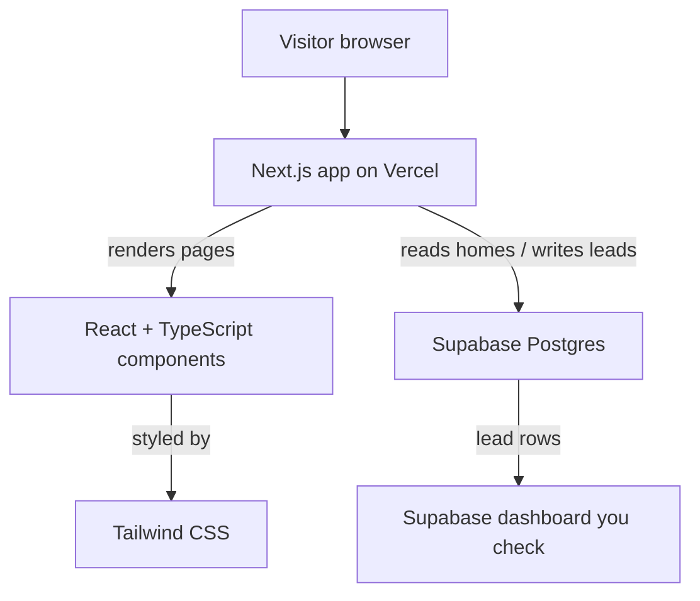
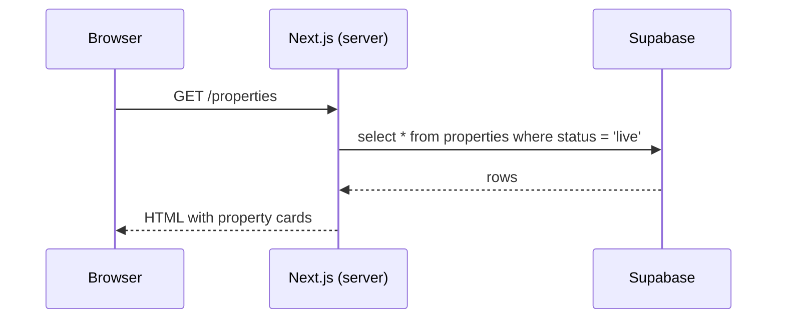
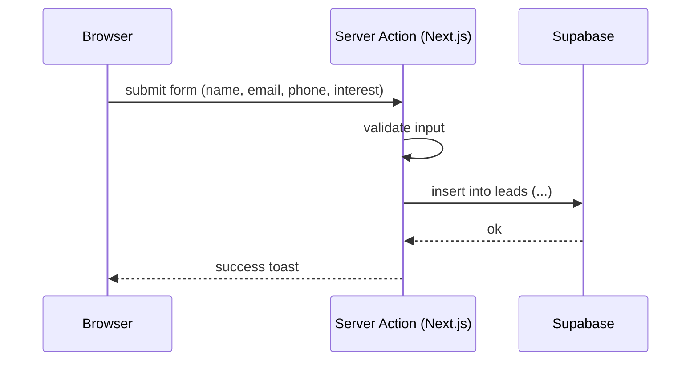
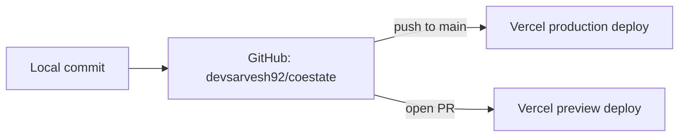

# Architecture

This document describes how CoEstate is put together — the target product architecture and how the pieces (Next.js, Supabase, Vercel) fit.

## System overview

### The pieces, and why

- **Next.js (App Router)** — the framework. Each folder in `app/` is a route. Code can run on the **server** (secure DB reads/writes, fast first paint) or in the **browser** (interactivity). Replaces the static HTML files.
- **React + TypeScript** — reusable UI components (e.g. one `PropertyCard` rendered for each home) with type safety to catch mistakes before runtime.
- **Tailwind CSS** — utility-class styling; our design tokens (Rausch, radii, spacing) become the Tailwind theme.
- **Supabase** — managed Postgres. Stores the `properties` we show and the `leads` we capture. Provides a dashboard to view/export leads.
- **Vercel** — hosting purpose-built for Next.js. Pushing to GitHub triggers an automatic deploy.

## Request flows

### Reading homes (server-rendered)

### Capturing a lead (Server Action)

The key difference from the prototype: leads are written to **Supabase** (one shared, queryable place you can show investors) instead of the browser's `localStorage`.

## Data model (planned Supabase tables)

**properties**

| column | type | notes |
|---|---|---|
| id | uuid | primary key |
| slug | text | URL identifier (e.g. `villa-azure`) |
| name | text | "Villa Azure" |
| location | text | "Alibaug, Maharashtra" |
| description | text | long copy |
| price_per_share | int | in rupees |
| total_shares | int | e.g. 11 |
| available_shares | int | e.g. 7 |
| images | text[] | image URLs |
| amenities | text[] | "Private pool", ... |
| rating | numeric | 4.8 |
| status | text | `live` / `draft` |
| created_at | timestamptz | default now() |

**leads**

| column | type | notes |
|---|---|---|
| id | uuid | primary key |
| type | text | `enquiry` / `booking` / `reservation` |
| name | text | |
| email | text | |
| phone | text | |
| message | text | nullable |
| interest | text | nullable |
| property_id | uuid | nullable FK → properties |
| created_at | timestamptz | default now() |

**Row Level Security (RLS):** public can `select` `properties`; public can `insert` into `leads` but **not** read them (only you, via the dashboard/service role).

## Environments & secrets

| Variable | Where | Purpose |
|---|---|---|
| `NEXT_PUBLIC_SUPABASE_URL` | Vercel + `.env.local` | Supabase project URL (safe to expose) |
| `NEXT_PUBLIC_SUPABASE_ANON_KEY` | Vercel + `.env.local` | Public anon key (RLS-protected) |
| `SUPABASE_SERVICE_ROLE_KEY` | Vercel (server only) | Privileged key for admin reads — never exposed to the browser |

`.env.local` is git-ignored. Production values are set in **Vercel → Project → Settings → Environment Variables**.

## Deployment pipeline

- Push to `main` → Vercel builds and deploys **production**.
- Open a Pull Request → Vercel publishes a **preview URL** for that branch, so changes can be reviewed before merging.
